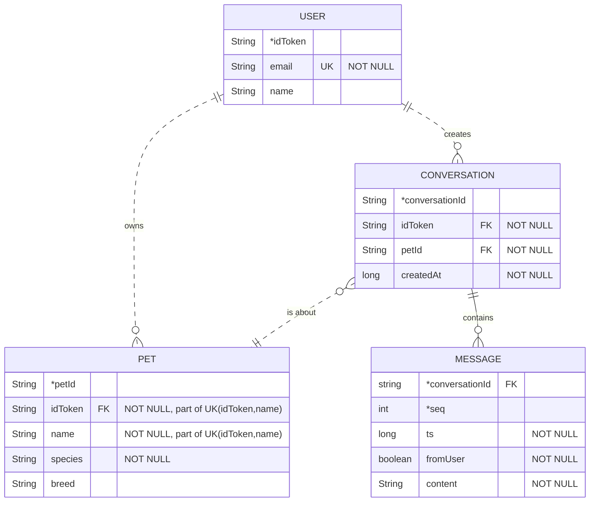

java.com.example.beagle.adapter:   questa cartella serve per: 
  - contenere le classi che fanno da ponte tra i dati e la UI di liste o griglie, come RecyclerView o ViewPager.
    
  📌 Cosa fa un Adapter
  
    - Riceve dati grezzi (lista di oggetti, array, cursore DB, ecc.).
    - Crea e riempie le view (righe, card, item) che l’utente vede a schermo.
    - Gestisce riciclo e riuso delle view per migliorare le prestazioni (RecyclerView).

java.com.example.beagle.service:   questa cartella serve per contenere tutte le API

java.com.example.beagle.sourse:   questa cartella serve per:
  - È il livello più vicino alla sorgente dei dati: può essere remota (API, Firebase, Google Sign-In) o locale (database Room, file,                        SharedPreferences).
  - Si occupa solo di recuperare o inviare dati, senza logica di business o UI.
  - Espone metodi “bassi” che il Repository userà per costruire operazioni più complesse.

# Diagrammi dell'architettura
Diagrammi creati con [mermaid](https://mermaid.js.org/intro/).

## Modificare i diagrammi
Per editare più comodamente i diagrammi:
1. Copia il codice di un singolo diagramma, escludendo la prima riga (` ```mermaid `) e l'ultima (` ``` `).
2. Incollalo in questo [tool](https://www.mermaidchart.com/play?utm_source=mermaid_live_editor).

## Diagramma ER (Entity Relationship)



Legenda:
- PK: Primary Key (chiave primaria), indicata anche con un asterisco (`type *id`)
- FK: Foreign Key (chiave esterna)
- UK: Unique Key (chiave unica o univoca)
- seq: numero sequenziale del messaggio (1, 2, 3...)
- ts: timestamp del messaggio
